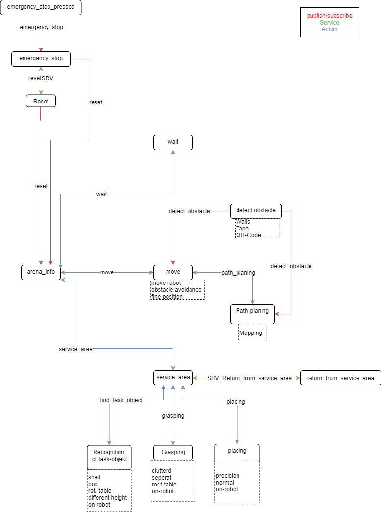

# commandtree_robocup
This is the commandtree implementation for the RoboCup@Work 2021. It receives the data from the refbox, creates a plan what has to be done and calls the other modules. 

In this project provides a basic framework for a finite automaton. 
The projects gets a task from the [refree-box](https://www.robocup.org/leagues/16) and will determine the objects of manipulation.
Afterwards th finite automaton will go through all states described below.
The overview is represented in commandtree_statediagramm.jpg.

## actions

### create
All actions are created wiht catkin_make in the action folder with the name ACT_Name.aciton.
To create the messages automatically you have to add the following (just in one package) in the CMakeLists.txt.
There are ohter solution in the [actionlib summery](https://wiki.ros.org/actionlib/#Build_a_package_by_Catkin).

    include(/opt/ros/melodic/share/ros/core/rosbuild/rosbuild.cmake)
    rosbuild_find_ros_package(actionlib_msgs)
    include(/opt/ros/melodic/share/actionlib_msgs/cmake/actionbuild.cmake)
    include(/opt/ros/melodic/share/geometry_msgs/cmake/geometry_msgsConfig.cmake)
    genaction()

### structure
The structure is similar to the [actionlib tutorial](https://wiki.ros.org/actionlib_tutorials/Tutorials/).
The action-server has a extra function (name_client(MSG_goal)) to send a goal to the client. 
Within this function it is possible to cancle the action.
For more details look ab at the [actionlib documentary](https://docs.ros.org/en/groovy/api/actionlib/html/classactionlib_1_1simple__action__client_1_1SimpleActionClient.html#a460c9f52fd650f918cb287765f169445).
The client is a new class and has to check frequently if the action is canceled.

### status
To check the status of the aciton look up [here](https://answers.ros.org/question/271257/guide-to-action-client-state-id-numbers/) out.

## scripts
All python scripts are in that folder.

### arena_info
The arena_info calculate all objects, which has to be manipulated. 
Therefore it looks at the start state and the end state of the arena given from the refree-box. 

    roslaunch atwork_commander atworkcommander.launch
    roslaunch atwork_commander generate.launch task:=BMT

First all objects will be deleted, which are in the same workinstation at the begining and at the end.
In the next step it creates a list of the manipultion objects with the follow structure [(start workingstation, destination workingstation, object)].

All the objects in the manipulation list are processed in the same structure.
    
    - First drive to tha start workingstation (move-node)
    - Next find and grasp the object and place it on the robot (service_area and the subclients find_task_object, grasping, placing and return_from_service_area)
    - Than drive to the destination workingstation (move_node)
    - Finally place the object from the robot on the workingstation (service_area and the subclients find_task_object, grasping, placing and return_from_service_area)

### wait
Gets a time as an action to wait.

### emergency_stop_pressed
Node which acts as a virtual stop signal. Ist publishes to the emergency_stop-node.

### emergency_stop 
This node subsribeds to emergency_stop_pressed and stops the main Loop in the function arena_info() in arena_info.py. While doing that, it calls the service "reset".

### reset
when the main loop is stoped, the reset-node gets called from emergency_stop. The function reset_publish(), publishes the reset signal to the topice "reset".
This resets the main loop in arena_info(). At the moment, reset is alwasy True. In a real case, this should be controlled by input or simular. It also returns a signal to emergency_stop with the result.

### service_area
The service_area node is an action-client and also a action-server. So it has a special structure.
First of all the service_area class has an attribute status

        status == 0: find object
        status == 1: grasp object
        status == 2: place object
    
The service_area goes throw all these statuses in a while-loop. 
When a subclient has invoked, the service_area-server will be committed. 
So if the arena_info cancel the service_area-action, the service_area-node also cancels the subaction. 
The status will be communicated via feedback. 

If the service_area got cancled, it promt cancle find_task_object, grasping or placing and than execute the return_from_service_area.

### find_task_object, grasping and placing
Thes are all action-server, which will be invoked by service_area successively.
In this nodes the workable functions have to be integrated.

### move
Move is used to move from a Postion to another, e.g. to a Workbench. It is connected to service_area via an action command and is the server. 

Move consists of the class MoveAction(), with the following Methods:

    The method move() ist responsibe to communicate with the wheels (not implemented yet). It gets called everytime there is a change in the movment of the wheels. 
    Obstacle_detected() gets info from the node object_detection if there is something. At the moment it is not realy in use
    execute_cb() is the main method, where the "move" action is called. In here is all the comunication to path_planing definded. 
    

### path_planing
Pathplaning is an action server which koordinates the movement of the wheels, by planning a path based on the map. The communication to the node "move" is done via the actionservers feedback. 

This node consists of two classes:
    pathPlaningAction:
        This class is responsible for the communication between the node "move" and the map. It gets the goal from "move" and delivers continues movementadjustment based on the Path that is beeing planed.
        Whilst communicating the movment, it publishes the current position for everybody. After reaching the goal, it delivers the final Position back to "move".
        
        The Methods:
        publish_currentPosition() publishes the current position on the topic 'current_position'.
        execute_cb() is the main method, which is called, when the path_planingAction is called. In in it publishes the movement as a feedback. Befor publishing it checks, if any objects in the way.
        
    MappingClass():
        This is where the maps and pathplaning is done. It gets called from palthPlaningAction() and is responible for the movement.
        
        The Methods:
        Mapping() is the pathplaing for the movement. it returns it to get published as feedback
        Object_dectected() is called, when anything gets published on 'object_detection'. Thsi could be used for placing objects to the map.
        get_current_position() is not used rigth now, but could be used as a get-Method
        
        
### object_detection
This node is responsible for detecting objects and publishing them. This is where sensors for movement should be implemented
    

## Messages
All messages are in the msg folder and have the name MSG_Name.msg.
Also the messages from the actions are in that folder.
The project uses also the messages from the [atwork_commander_msgs](https://github.com/robocup-at-work/atwork-commander/tree/master/atwork_commander_msgs) packeage, so they has to be integrated in the CMakeLists.txt.

##  robot_arm_communication.zip
This is the project for the other robocup-groupe, where they can include their code for stacking cubes with the robot-arm.

## TODO
- [ ] Service to get the table position from the table string (or param server?)
- [ ] Implement move node
- [ ] Implement service area
- [ ] Implement find task object
- [ ] Implement grasping 
- [ ] Implement placing
- [ ] Implement error recovery
- [ ] Publish alive signal (There is no refbox during the online cup so we don't need an alive signal)
- [ ] Remove all these spinning whiles
